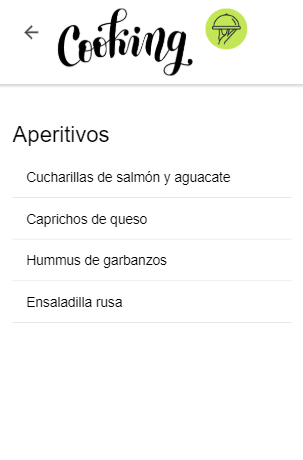
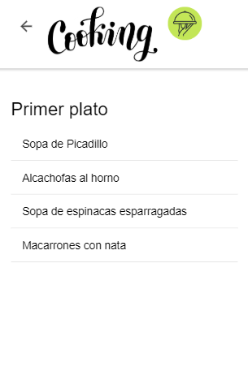
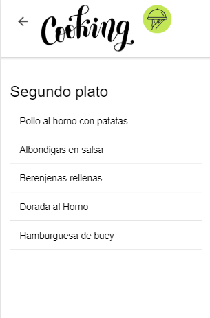
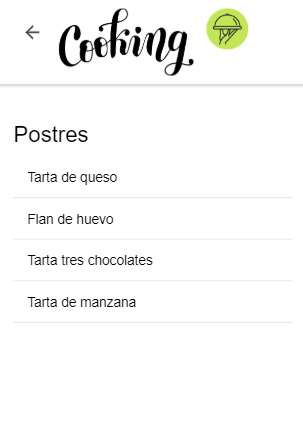
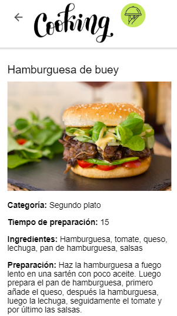
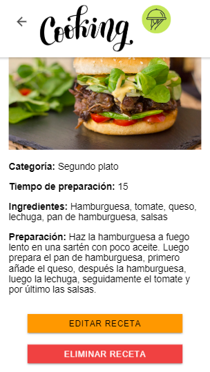

# COKING ionic App :hamburger: :dango: :poultry_leg:

_Aplicación de recetas para la asignatura de Acceso a Datos del grado superior Desarrollo de Aplicaciones Multiplataforma del IES Campanillas._
 
## Introducción
 _El objetivo de está aplicación es que los usuarios puedan ver recetas para aprender a cocinar y añadir sus propias recetas para compartirlas con el resto de usuarios que se descarguen la aplicación._
 
_A continuación voy a explicar las distintas funcionalidades y las pantallas que tiene la aplicación:_

### Página principal y menú de categorías
 _Al entrar aparece una pantalla de bienvenida con una imagen y un botón que te redirige a una lista de categorías para ver recetas._

 

### Lista de recetas

_Al pulsar en una categoría aparece una lista de recetas._

Aperitivos y primeros platos  
 

Segundos platos y postres  
 

### Recetas
_Al pulsar en cualquier receta aparece una descripción de la receta, por ejemplo vamos a pulsar en un segundo plato:_

 

